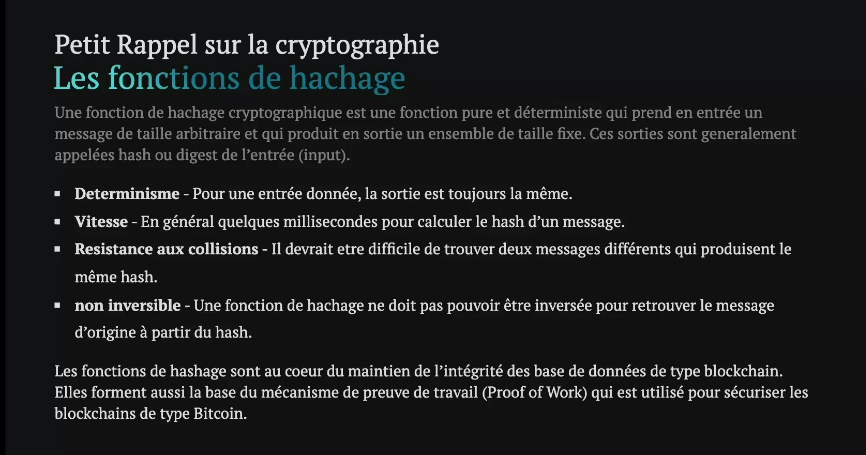
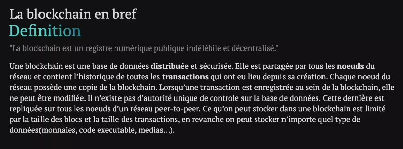
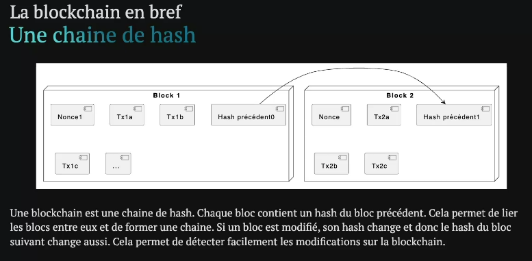

# Cours

### Petit rappel :

blockchain est un systeme de gestion de donnée
- Les fonctions de hashage : maintien intégrité des bases de données

Proof of work : preuve de travail
- Le hashage est aussi utilisé pour sécurisé les blockchains de bitcoin

cryptographie asymétrique :
- on va mettre les données de manière de plusieurs caractére illisible et certaine personne pourra lire c'est caractére illisible
- celui qui a la clé privée : peut envoyer des messages
- celui qui a la clé publique : peut le lire et vérifier que c'est authentique
- Beaucoup d'algorithme de crypo asymétrique existent comme : RSA et ECDSA. (Ethereum utilise ECDSA)

### La blockchain en bref

une transaction (requête, une operation d'écriture) est irréversible, indélibile impossible de revenir de arrière.

etherscan est un explorateur de block

Interface : un ensemble de methodes non implementer